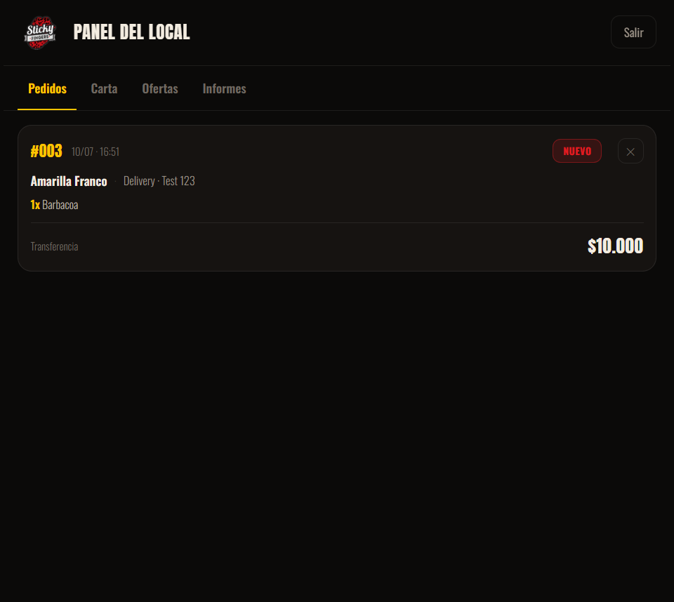
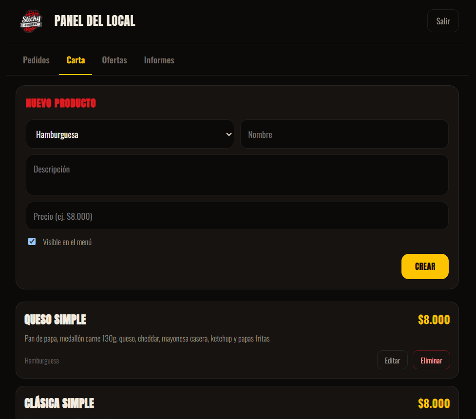
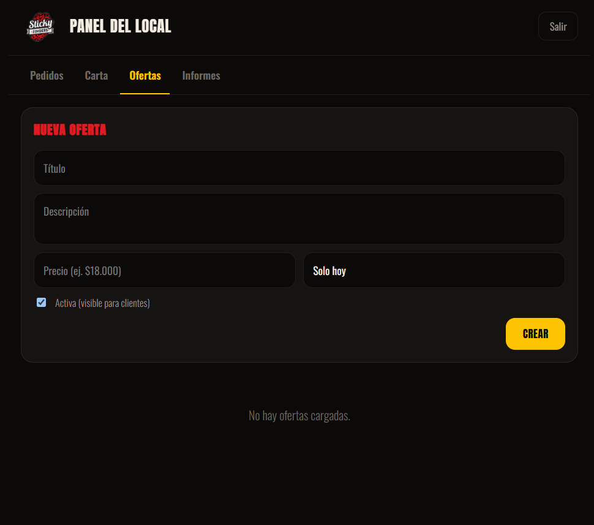
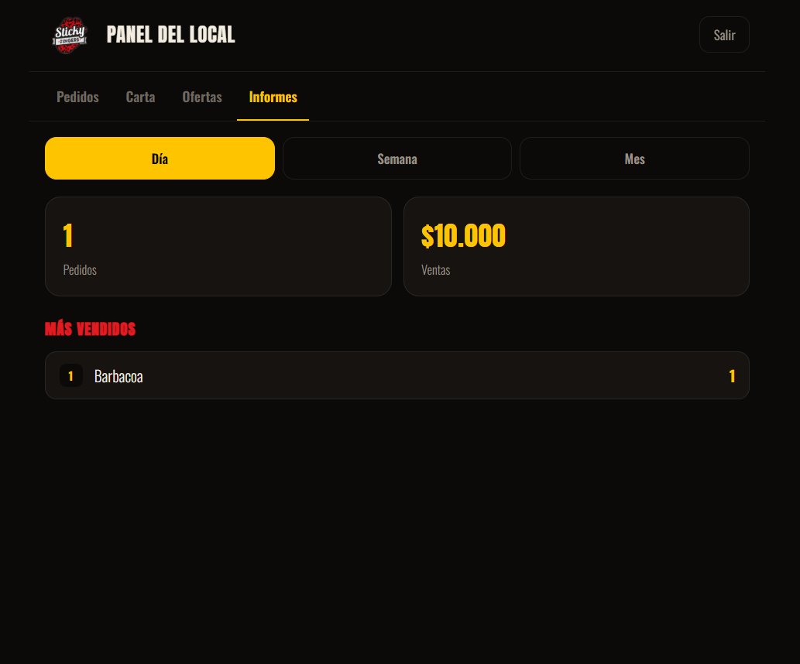

# Sticky Fingers

Sistema de gestión de pedidos para una hamburguesería, con carta y checkout para el cliente y un panel de gestión para el local (pedidos en tiempo real, ofertas e informes de ventas).

🍔 **En vivo:** [stickyfingers.me](https://stickyfingers.me)

El detalle completo del stack, la arquitectura y los objetivos está en [`CLAUDE.md`](./CLAUDE.md).

## Estructura del repositorio

```text
StickyFingers/
├── backend/            # API REST — Spring Boot 3 / Java 21
├── frontend/           # SPA — Angular 22 (cliente + panel del local)
├── docker-compose.yml  # PostgreSQL
└── CLAUDE.md           # Stack tecnológico, arquitectura y buenas prácticas
```

- **Cliente:** carta, carrito y checkout en `/`.
- **Panel del local:** en `/panel` (acceso separado, login en `/panel/login`; los clientes no tienen acceso).

## Panel del local

| Pedidos en tiempo real | Gestión de carta |
| --- | --- |
|  |  |
| **Ofertas** | **Informes de ventas** |
|  |  |

## Cómo levantar todo (desarrollo)

Requisitos: **Docker**, **Java 21** y **Node 20+**.

### 1. Base de datos (PostgreSQL)

Desde la raíz del repo:

```bash
docker compose up -d postgres
```

### 2. Backend (API en `http://localhost:8080`)

```bash
cd backend
./mvnw spring-boot:run
```

Flyway crea el esquema y siembra el menú. Al iniciar se crea el usuario admin si no existe
(`admin` / `admin123`). Swagger UI en `http://localhost:8080/swagger-ui.html`.

### 3. Frontend (SPA en `http://localhost:4200`)

```bash
cd frontend
npm install   # solo la primera vez
npm start     # = ng serve
```

Abrir `http://localhost:4200` (cliente) y `http://localhost:4200/panel` (panel, login admin).

### Bajar todo

```bash
docker compose down          # detiene y quita PostgreSQL
# cortar backend y ng serve con Ctrl+C en sus terminales
```

## Reglas de negocio clave

- Máximo 6 hamburguesas por pedido.
- Medallón extra: +$3500 por unidad.
- Medios de pago: **efectivo** o **transferencia**, sin recargo. Total = subtotal + envío.
- Entrega: retiro en local o delivery (costo por distancia, con recargo por lluvia; radio máximo 3 km).
- Estados de pedido: `NUEVO → EN_PREPARACION → LISTO → ENTREGADO`.

## Documentación por módulo

- Backend: [`backend/README.md`](./backend/README.md) — endpoints, variables de entorno, tests.
- Stack y arquitectura: [`CLAUDE.md`](./CLAUDE.md).
